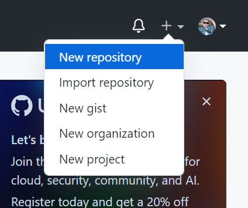

# latihan1 
# LATIHAN VCS

## TUGAS BAHASA PEMROGRAMAN

## Instalali Git
 - Buka wabsite resmi Git (https://git-scm.com/)
 - Kemudian unduh Git sesuai OS
 - Selamat, Git sudah terinstal di windows. untuk mencobanya silahkan buka **CMD** atau **powershell**, kemudian ketik perintah.
```
git --version
```
 
 

 ## Menambahkan Global Config
 - Pada saat pertama kali, perlu di perhatikan konfigurasi *user.name* dan *user.email*
 - Konfigurasi ini bisa di lakukan untuk global repository atau individual repository.
 - Apabila belum di lakukan konfigurasi, akan mengakitbatkan terjadi kegagalan saat menjalankan perintah git commit

 - Config Global Repository
 ```
 $ git config --global user.name "nama_user"
 ```
 ```
 $ git config --global user.email "nama_user"
 ```


 ## Perintah Dasar Git
 - **git init**, perintah untuk membuat repository local
 - **git add**, perintah untuk menambahkan file baru, atau perubahan pada file pada staging sebelum proses commit.
 - **git commit**, perintah untuk menyimpan perubahan kedalam database git.
 - **git push -u origin master**, perintah untuk mengirim perubahan pada repository local menuju server repository.
 - **git clone [url]**, perintah untuk membuat working directory yang di ambil dari repository server.
 - **git remote add origin [url]**, perintah untuk menambahkan remote server/repository server pada local repository (*working direktory*)
 - **git pull**, perintah untuk mengambil/mendwonload perubahan terbaru dari server repositoy ke local repository


 ## Membuat Repository Local
 - Buka direktory aktif: **d:\labs_pemrograman1** (buka menggunakan Widows Explore)
 - klik kanan pada direktory aktif tersebut, dan pilih menu **Git Bash**, sehingga muncul *git bash command*
 - Buat direktory project praktikum pertama dengan nama **latihan1**
  ```
  $ mkdir latihan1
  ```
  ```
  $ cd latihan1
  ```
 - Sehingga terbentuk satu direktory baru dibawahnya, selanjutnya masuk kedalam direktory tersebut dengan perintah **cd** (*change direktory*)
 - direktory aktif menjadi: **d:\lab_pemrograman1\latihan1**
 
 
 ## Membuat Repository Local
 - Jalan **git init**, untuk mebuat repository local
 ```
 $ git init
 ```
 - Repository baru berhasil di inisialisasi, dengan terbentuknya satu direktory hidden dengan nama **.git**
 - Pada direktory tersebut, semua perubahan pada *working direktory* akan di simpan.
 
 
  ## Menambahkan File Baru Pada Repository
  - Untuk membuat file dapat menggunakan text editor, lalu menyimpan filenya pada direktory aktif (repository)
  - Disinni kita akan coba buat satu file bernama README.md (text file)
  ```
  $ echo "# latihan1 " >> README.md
  ```
  - File **README.md** berhasil dibuat.
  


  ## Menambah File Repository
  - Untuk menambah file baru saja dibuat tersebut gunakan perintah **git add**.
  ```
  $ git add README.md
  ```
  - file **README.md** berhasil ditambahkan.
  
  
  
  ## Commit (Menyimpan perubahan ke database)
  - Untuk menyimpan perubahan yang ada kedalam database repository local, gunakan perintah **git commit -m "komentar commit"**
  ```
  $ git commit -m "file pertama saya"
  ```
  - Perubahan berhasil disimpan.
  
  
  
  ## Membuat Repository Server
  - Server repository yang akan digunakan adalah https://github.com
  - Anda harus membuat akun terlebih dahulu.
  - Pada laman github, klik tombol **sign up for GitHub**, atau
  - Dari menu icon (+) klik new repository
  
  
  
  
  ## Membuat Repository Server
  - Isi nama repository nya, misal: Belajar1
  - Lalu klik tombol **create repository**
  
  
  
  
  ## Menambahkan Remote Repository
  - Remote repository merupakan repository server yang akan digunakan untuk menyimpan setiap perubahan pada local repository, sehingga banyak diakses oleh banyak user.
  - Untuk menambahkan remote repository server, gunakan perintah **git remote add origin [url]**
  ```
  $ git remote add origin https://github.com/Agussetiaa/belajar1.git
  ```
  

  ## Push (Mengirim perubahan ke server)
  - Untuk mengirim perubahan pada local repository ke server gunakan perintah **git push**.
  ```
  $ git push -u origin master
  ```
  - Perintah ini akan meminta memasukan username dan password pada akun github.com
  
  
  
  ## Melihat Hasilnya Pada Server Repository
  - Buka laman github.com, arahkan pada repository nya
  - Maka perubahan akan terlihat pada laman tersebut.
  [Gambar](Gambar/10.png)
  
  
  ## Clone repository
  - Clone repository, pada dasarnya akan meng-copy repository server dan secara otomatis membuat satu direktory sesuai dengan nama repositorynya (*working direktory*)
